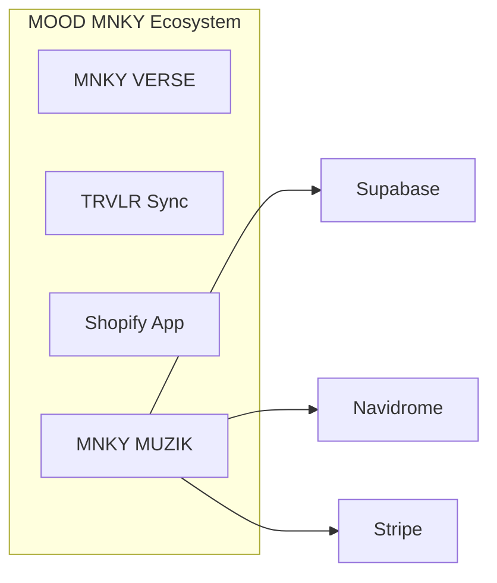

# MNKY MUZIK


**A self-hosted, Spotify-style music experience.**

MNKY MUZIK is a PWA that combines your local music stack (Navidrome, Lidarr) with optional Spotify integration and AI-powered discovery. Stream from Navidrome, connect Spotify for playlists and recommendations, request new music via Lidarr, and use AI to generate playlists from natural-language prompts. Playback is gated by Stripe subscription or beta access.

Part of the [MOOD MNKY](https://docs.moodmnky.com) ecosystem. For brand and ecosystem context, see [docs.moodmnky.com](https://docs.moodmnky.com).

---

## Live app

**[https://muzik.moodmnky.com](https://muzik.moodmnky.com)**

---

## Features

- **Authentication** — Email/password sign-up and login (Supabase Auth); optional [Sign in with Spotify](docs/SPOTIFY_OAUTH.md) (OAuth) for playlists, saved tracks, and recommendations.
- **Navidrome** — Stream and browse your music library (albums, artists, playlists); scrobbling and “liked” tracks.
- **Lidarr** — Request new artists/albums; enriched search with Spotify and MusicBrainz; “already in library” from Navidrome.
- **Spotify** — When connected: playlists, saved tracks, recommendations on home and account; token refresh on 401.
- **AI** — Generate playlists from natural-language prompts; “describe search” for unified search.
- **Subscription & beta** — Stripe subscription or [beta code](docs/BETA_ACCESS.md) to unlock playback.
- **PWA** — Installable app; responsive UI with queue, player, and now-playing.

---

## Tech stack

- **Frontend:** Next.js (App Router), React, TypeScript, Tailwind CSS, ShadCN UI
- **Auth & backend:** Supabase (Auth, Postgres, Storage), Stripe
- **Music:** Navidrome (Subsonic API), Lidarr, Spotify Web API (client credentials + OAuth), MusicBrainz (optional)
- **AI:** OpenAI (playlist and search describe)



---

## Getting started

This project uses **pnpm**. Install and run:

```bash
pnpm install
pnpm dev
```

Other commands: `pnpm build`, `pnpm start`, `pnpm lint`.

### Environment variables

- **Local:** Copy `.env.example` to `.env.local` and fill in values (Supabase, Stripe, Spotify, Navidrome, etc.).
- **Production (Vercel):** Use the checklist in [docs/ENV_VERCEL.md](docs/ENV_VERCEL.md) to set the same variables in Vercel → Project → Settings → Environment Variables.

### Stripe subscription setup

1. Add Stripe keys to `.env.local` (from [Stripe Dashboard](https://dashboard.stripe.com/apikeys)).
2. Run the one-time setup to create the Premium product and a recurring monthly price (and optionally sync to Supabase):

   ```bash
   pnpm run stripe:setup
   ```

3. Register the webhook in Stripe: **Developers → Webhooks → Add endpoint**
   - **URL:** `https://your-domain.com/api/webhooks` (or for local testing use [Stripe CLI](https://stripe.com/docs/stripe-cli): `stripe listen --forward-to localhost:3000/api/webhooks`)
   - **Events:** `product.created`, `product.updated`, `price.created`, `price.updated`, `checkout.session.completed`, `customer.subscription.created`, `customer.subscription.updated`, `customer.subscription.deleted`
   - Copy the signing secret into `.env.local` as `STRIPE_WEBHOOK_SECRET`.

---

## Documentation

- [PRD.md](PRD.md) — Product requirements and technical overview
- [docs/BETA_ACCESS.md](docs/BETA_ACCESS.md) — Beta code and playback access
- [docs/SPOTIFY_OAUTH.md](docs/SPOTIFY_OAUTH.md) — Spotify OAuth and redirect URLs
- [docs/ENV_VERCEL.md](docs/ENV_VERCEL.md) — Production environment variables checklist
- [docs/SUPABASE_LOCAL.md](docs/SUPABASE_LOCAL.md) — Local Supabase setup
- [docs.moodmnky.com](https://docs.moodmnky.com) — MOOD MNKY ecosystem and brand

---

## License

This project is licensed under the terms of the MIT license.

---

## Contributions

Contributions, issues, and feature requests are welcome. For ecosystem and support context, see [docs.moodmnky.com](https://docs.moodmnky.com).
